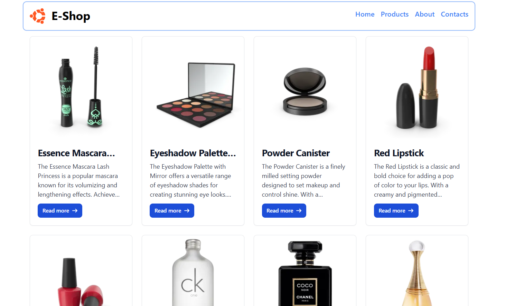

# E-Shop

A modern, fully mobile-responsive e-commerce web app built with React, Vite, and Tailwind CSS.

## Features

- **Product Listing:** Browse a paginated list of products fetched from a public API.
- **Product Details:** Click on any product to view detailed information, including images, price, rating, discount, and reviews.
- **Responsive Design:** Seamless experience on mobile, tablet, and desktop devices.
- **Navigation:** Simple navigation bar for easy access to Home, Products, About, and Contacts.

## Tech Stack

- [React](https://react.dev/)
- [Vite](https://vitejs.dev/)
- [Tailwind CSS](https://tailwindcss.com/)
- [React Router](https://reactrouter.com/)
- [@smastrom/react-rating](https://www.npmjs.com/package/@smastrom/react-rating)

## Getting Started

1. **Clone the repository:**
   ```sh
   git clone https://github.com/your-username/e-shop.git
   cd e-shop
   ```

2. **Install dependencies:**
   ```sh
   npm install
   ```

3. **Run the development server:**
   ```sh
   npm run dev
   ```

4. **Open in your browser:**
   Visit [http://localhost:5173](http://localhost:5173)

## Folder Structure

```
src/
  App.jsx
  Home.jsx
  Cards.jsx
  Card.jsx
  CardDetails.jsx
  Navbar.jsx
  assets/
public/
index.html
tailwind.config.js
vite.config.js
```

## Screenshots

| Product List (Desktop) | Product Details (Mobile) |
|------------------------|--------------------------|
|  |  |

## API

Products are fetched from [DummyJSON Products API](https://dummyjson.com/products).

